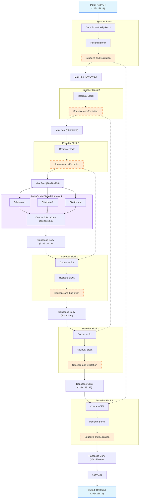

# AdvancedResUNet (E06-D) Architecture

```mermaid
graph TD
    classDef input fill:#e1f5fe,stroke:#3b82f6,stroke-width:2px;
    classDef output fill:#e1f5fe,stroke:#3b82f6,stroke-width:2px;
    classDef encoder fill:#fef3c7,stroke:#2563eb,stroke-width:2px;
    classDef decoder fill:#dcfce7,stroke:#d97706,stroke-width:2px;
    classDef bottleneck fill:#f3e8ff,stroke:#7c3aed,stroke-width:2px;
    classDef se fill:#ffedd5,stroke:#ea580c,stroke-width:1px,stroke-dasharray: 5 5;

    Input["Input: NoisyLR (128×128×1)"]:::input

    %% Encoder Block 1
    subgraph E1[Encoder Block 1]
        Conv1["Conv 3x3 + LeakyReLU"]
        Res1["Residual Block"]
        SE1["Squeeze-and-Excitation"]:::se
    end
    Pool1["Max Pool (64×64×32)"]

    %% Encoder Block 2
    subgraph E2[Encoder Block 2]
        Res2["Residual Block"]
        SE2["Squeeze-and-Excitation"]:::se
    end
    Pool2["Max Pool (32×32×64)"]

    %% Encoder Block 3
    subgraph E3[Encoder Block 3]
        Res3["Residual Block"]
        SE3["Squeeze-and-Excitation"]:::se
    end
    Pool3["Max Pool (16×16×128)"]

    %% Dilated Bottleneck
    subgraph B[Multi-Scale Dilated Bottleneck]
        Dil1["Dilation = 1"]
        Dil2["Dilation = 2"]
        Dil4["Dilation = 4"]
        Concat["Concat & 1x1 Conv (16×16×256)"]
    end
    B:::bottleneck

    %% Decoder Block 3
    Up3["Transpose Conv (32×32×128)"]
    subgraph D3[Decoder Block 3]
        Cat3["Concat w/ E3"]
        DRes3["Residual Block"]
        DSE3["Squeeze-and-Excitation"]:::se
    end

    %% Decoder Block 2
    Up2["Transpose Conv (64×64×64)"]
    subgraph D2[Decoder Block 2]
        Cat2["Concat w/ E2"]
        DRes2["Residual Block"]
        DSE2["Squeeze-and-Excitation"]:::se
    end

    %% Decoder Block 1
    Up1["Transpose Conv (128×128×32)"]
    subgraph D1[Decoder Block 1]
        Cat1["Concat w/ E1"]
        DRes1["Residual Block"]
        DSE1["Squeeze-and-Excitation"]:::se
    end

    %% Final Output
    FinalUp["Transpose Conv (256×256×16)"]
    FinalConv["Conv 1x1"]
    Output["Output: Restored (256×256×1)"]:::output

    %% Flow
    Input --> Conv1 --> Res1 --> SE1
    SE1 --> Pool1 --> Res2 --> SE2
    SE2 --> Pool2 --> Res3 --> SE3
    SE3 --> Pool3

    Pool3 --> Dil1 & Dil2 & Dil4 --> Concat

    Concat --> Up3 --> Cat3 --> DRes3 --> DSE3
    DSE3 --> Up2 --> Cat2 --> DRes2 --> DSE2
    DSE2 --> Up1 --> Cat1 --> DRes1 --> DSE1
    DSE1 --> FinalUp --> FinalConv --> Output

    %% Skip Connections
    SE3 -.-> Cat3
    SE2 -.-> Cat2
    SE1 -.-> Cat1
```
